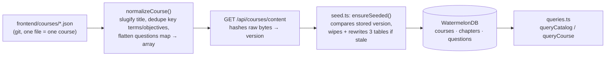
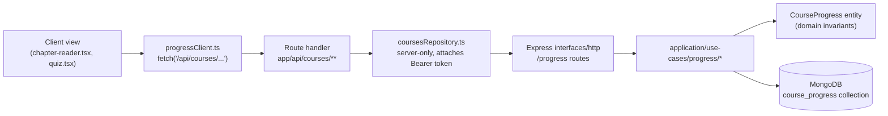
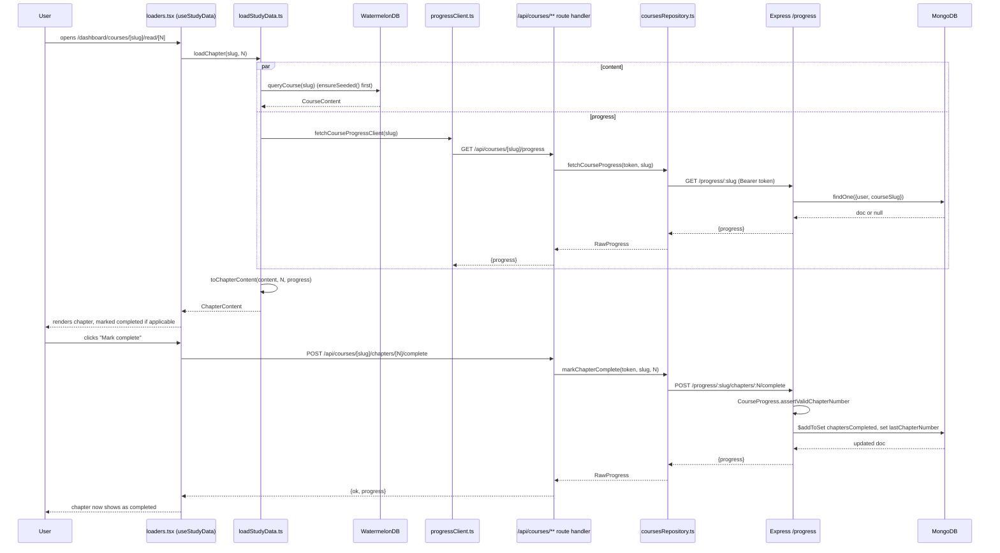
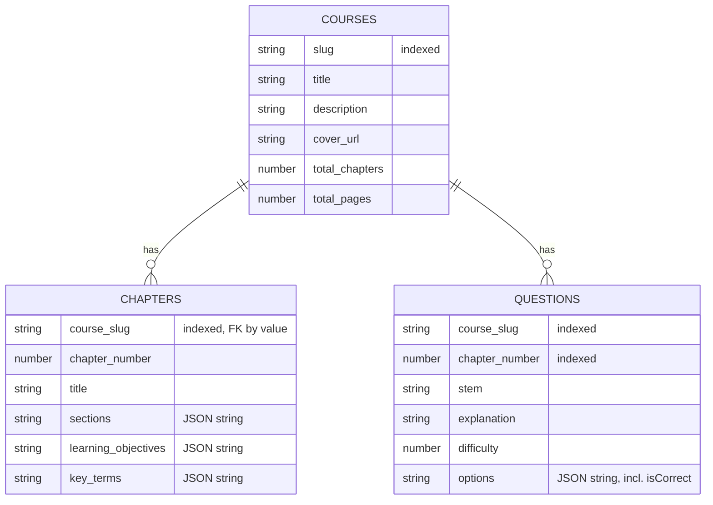

# GradeUp — Course Module System Design

A deep dive on `frontend/src/courses/`: how course content is authored,
served, stored, read, and merged with per-user progress — and precisely how
that connects to auth, onboarding, the dashboard, and the sibling Tests
module. Companion to the whole-system [SYSTEM_DESIGN.md](SYSTEM_DESIGN.md);
this document goes one level deeper on a single module.

---

## 1. Scope and the one decision that shapes everything

The course module has two kinds of data that live in different places for a
deliberate reason:

| | Content (chapters, key terms, quiz questions) | Progress (chapters done, quiz scores) |
|---|---|---|
| Same for every user? | Yes | No |
| Source of truth | `frontend/courses/*.json` (git) | MongoDB `CourseProgress` collection |
| Runtime home | WatermelonDB, in the browser | Express API, behind auth |
| Written by | Content authoring (git commit) | The signed-in user, via API calls |
| Read latency | Local DB query — no network | One `fetch` per page, cookie-gated |

Nothing in the course module writes content and nothing outside the module
(no admin panel, no backend endpoint) can currently modify a course's
chapters or questions — the only way content changes is a new/edited JSON
file landing in `frontend/courses/`. This asymmetry — read-heavy, static
content vs. small, mutable per-user state — is why the module has two
parallel pipelines instead of one, traced end-to-end below.

---

## 2. Module map

```
frontend/src/courses/
├─ model/courses.ts          view-facing TS types (CourseSummary, CourseDetail,
│                             ChapterContent, QuizData, FlashcardsData) + the
│                             raw CourseContent/RawProgress shapes
├─ data/
│   ├─ normalizeCourse.ts     raw JSON → CourseContent (server-only)
│   ├─ loadStudyData.ts       composed client loaders: content + progress → view shape
│   ├─ assemble.ts            pure merge functions (content ⨝ progress)
│   └─ progressClient.ts      browser fetchers for /api/courses/progress*
├─ db/                        WatermelonDB: schema, models, seed, queries
├─ repository/
│   └─ coursesRepository.ts   server-only: BFF → Express /progress calls
└─ view/                      presentational components + loaders.tsx (client hooks)
```

One deviation from the repo-wide feature-slice convention (documented in
`SYSTEM_DESIGN.md` §3.1) is worth naming: there is no `viewmodel/` folder
here. Its job — a hook owning load state and orchestration — is done by
`useStudyData` inside `view/loaders.tsx` instead. `data/loadStudyData.ts`
plays the role a `viewmodel` would elsewhere: it composes the content and
progress reads and hands back a plain object, and `loaders.tsx` just tracks
loading/error/ready state around that call.

---

## 3. Content pipeline: JSON → WatermelonDB → local reads



**Authoring → catalog.** `app/api/courses/content/route.ts` reads every
`*.json` in `frontend/courses/` at request time (`readdir` + `readFile`, no
build step), runs each through `normalizeCourse()`, and returns
`{version, courses}`. Dropping a new JSON file in that folder adds a course
with zero code changes; a slug collision is resolved "first file wins" so
the catalog stays de-duplicated. `version` is a SHA-1 over every file's name
+ raw bytes — a real content hash, not a manually bumped number, so it can't
drift out of sync with the files it describes.

**Normalization** (`normalizeCourse.ts`) turns the loosely-shaped export
format (`documentMetadata`, a `chapters` array, a `questions` object keyed
`"chapter1"`, `"chapter2"`, …) into the flat `CourseContent` shape the rest
of the module depends on: slug derived from title, learning
objectives/key terms de-duplicated case-insensitively preserving first-seen
order, and the `questions` map flattened into one array tagged with
`chapterNumber`. This function is explicitly the JSON-in-JSON-out successor
to a retired `backend/src/scripts/seedCourses.js` — the same shaping logic,
just no longer writing to Mongo.

**Seeding** (`db/seed.ts`) runs once per browser session, memoized behind a
module-level promise so concurrent callers (e.g. the catalog page and the
"Continue learning" dashboard island mounting at once) share one fetch. It
compares the served `version` against `localStorage["gradeup_courses_version"]`;
on a mismatch (or an empty DB) it deletes every row in all three tables and
rewrites them inside a single `db.batch()`. Content is treated as fully
disposable and cheaply re-derivable — there's no incremental diffing.

**Storage shape.** WatermelonDB columns are scalar-only, so nested
structures — chapter `sections`, `learningObjectives`, `keyTerms`, and
question `options` — are stored as JSON strings and parsed back out by
getters on the model classes (`db/models.ts`). Those models are written
without decorators (`@field`/`@text`) specifically to avoid a Babel
dependency that would conflict with Turbopack; each getter is the plain
`this._getRaw(...)` a decorator would compile to anyway.

**Reads** (`db/queries.ts`) are synchronous local queries once
`ensureSeeded()` resolves: `queryCatalog()` for the lightweight tile list
(title, cover, chapter/question counts), `queryCourse(slug)` for a full
course including every chapter and question. Both call `ensureSeeded()`
first, so any component can call them directly without a separate
"is content ready" check.

The LokiJS adapter that WatermelonDB uses on web is dynamically imported
inside `db/database.ts` and the whole module is guarded behind
`typeof window === "undefined"` → rejected promise, because it must never
execute during Next.js server rendering.

---

## 4. Progress pipeline: browser → BFF → Express → Mongo



Course *progress* still goes through the full backend stack described in
`SYSTEM_DESIGN.md` §3.4 — this module doesn't bypass Clean Architecture, it
just supplies two of its use cases. On the frontend side, the cookie holding
the access token is read server-side in each route handler
(`app/api/courses/[slug]/chapters/[chapter]/complete/route.ts`, etc.) and
never touches browser JS; `coursesRepository.ts` (marked `import
"server-only"`) is the one place that turns it into an
`Authorization: Bearer <token>` header toward Express.

**Backend side**, per `SYSTEM_DESIGN.md` §5:

- One Mongo document per `(user, courseSlug)`, enforced by a compound unique
  index — there's no `Course` document; the slug is just a string key.
- The `CourseProgress` domain entity (`backend/src/domain/entities/CourseProgress.js`)
  owns two invariants regardless of caller: `chaptersCompleted` stays sorted
  and deduplicated, and `quizResults` keeps only the **latest** result per
  chapter (a retake overwrites, it doesn't append). `assertValidChapterNumber`
  and `assertValidQuizResult` are `static` so both the use case (validating
  input before it reaches persistence) and unit tests (building an in-memory
  entity) can call them without a repository.
- The two use cases are one line each — `markChapterComplete` and
  `saveQuizResult` validate, then delegate the actual write to
  `progressRepository`, which applies it atomically (`$addToSet` /
  `$pull`+`$push`) so two concurrent requests for the same user can't clobber
  each other. The entity's invariants and the repository's atomicity are
  deliberately redundant — the entity guards correctness for anyone
  constructing a `CourseProgress` in memory (e.g. tests), the repository
  guards correctness under real concurrency.

**Two user-triggered writes**, both explicit button presses in the view
layer (not automatic on page view):

- `chapter-reader.tsx`'s `handleComplete()` → `POST
  /api/courses/[slug]/chapters/[chapter]/complete` → `markChapterComplete`.
- `quiz.tsx`'s submit handler → `POST
  /api/courses/[slug]/chapters/[chapter]/quiz/submit` (score + total in the
  body) → `saveQuizResult`.

Both route handlers validate the chapter number / score shape before ever
calling the backend (see `complete/route.ts`, `quiz/submit/route.ts`) — a
second line of defense in front of the domain validation, catching malformed
requests one hop earlier.

**Grading happens client-side.** The quiz's correct answers travel to the
browser as part of `QuizData` (`assemble.ts`'s `toQuizData` includes
`isCorrect` on every option) because the questions are already public,
client-local content — there's no separate "submit answers, get graded"
round trip. The backend only ever receives the final `{score, total}`, not
the individual answers, which is a smaller trust surface than the
Tests/Diagnostics modules (`SYSTEM_DESIGN.md` §5 shows their `Attempt`
entity stores embedded per-question answers — courses don't).

---

## 5. Where content and progress actually meet: `assemble.ts`

Nothing server-side ever joins a course's content to a user's progress —
there is no course document in Mongo to join against. The merge is four pure
functions in `data/assemble.ts`, each taking a `CourseContent` (from
WatermelonDB) and a `RawProgress | null` (from the backend) and returning one
of the view shapes:

| Function | Produces | Used by |
|---|---|---|
| `toCourseSummary` | `CourseSummary` — tile with `progress: number` (%) | Catalog grid, "Continue learning" |
| `toCourseDetail` | `CourseDetail` — full chapter list, each flagged `completed` | Course detail page |
| `toChapterContent` | `ChapterContent` — one chapter's reading content + prev/next | Chapter reader |
| `toQuizData` | `QuizData` — one chapter's questions, options carry `isCorrect` | Quiz view |
| `toFlashcards` | `FlashcardsData` — every chapter's key terms grouped | Flashcards view |

A `RawProgress` of `null` (never started) is treated identically to an empty
one via `EMPTY_PROGRESS`, so every "0 of N chapters, 0%" state is the normal
default path, not a special case a component has to branch on.

`data/loadStudyData.ts` is what actually calls these — it fires the content
query (WatermelonDB) and the progress fetch (backend, through the BFF) with
`Promise.all`, then merges. This is worth stating plainly because it's a
real architectural inversion: the comment in `assemble.ts` says outright that
this is "the merge the Express/Mongo service used to perform" before the
local-first rework — it now happens **in the browser**, once per page,
instead of on the server once per request. The trade this buys: content
reads scale to zero backend cost, at the price of every course page needing
two async sources instead of one server-rendered payload, and of that merge
logic being unit-testable only as pure client functions rather than as a
backend integration test.

---

## 6. Request-level sequence: opening and finishing a chapter



The two branches of the `par` block matter for failure behavior: if
WatermelonDB seeding fails, the whole page fails (content is required — there
is nothing to show without it). If the progress fetch 401s (signed out, or
token expired), `progressClient.ts` returns `[]` / `null` instead of
throwing, and `assemble.ts` treats that identically to "never started" — so
a logged-out or session-expired user still sees the chapter content, just
with no completion state. This mirrors the system-wide graceful-degradation
rule in `SYSTEM_DESIGN.md` §11.

---

## 7. Integration with the rest of the system

This is the part most likely to surprise someone reading only the course
module in isolation — several connections that look like they should exist,
don't yet, and one connection that's more wired than the top-level docs
currently claim.

### 7.1 Dashboard — "Continue learning" (real, not a placeholder)

`src/dashboard/view/continue-learning.tsx` calls `loadCourseSummaries()`
directly — the same function the catalog page uses — filters to courses with
`chaptersCompleted > 0 && progress < 100`, and falls back to the full catalog
if nothing is in progress yet. **This is live data**, not the
`continueLearningPlaceholder` constant still defined in
`src/dashboard/model/dashboard.ts` (that constant is now dead for this
widget — nothing imports it for rendering, only for text that's since been
hardcoded locally). This is a correction worth carrying forward: the
repo-root `SYSTEM_DESIGN.md` §13 currently lists "Continue learning" as an
explicit placeholder — that's stale as of this reading. `todayGoalPlaceholder`,
by contrast, genuinely is still a placeholder (`dashboard.tsx:152` destructures
it directly and nothing computes a real daily-study count).

### 7.2 Readiness score — courses are NOT an input

`src/dashboard/view/readiness-score.tsx` averages the Tests module's average
score and the most recent diagnostic attempt's percent. **Course chapter
completion and quiz scores are not part of that formula at all** — a user
could complete every chapter in every course and the readiness score
wouldn't move, because it only reads from `fetchAllAttemptsClient()` and
`fetchAllDiagnosticAttemptsClient()`, never from `coursesRepository`. Whether
that's intentional (readiness = demonstrated test performance, not reading
completion) or a gap depends on product intent, but it's not visible from
reading the dashboard in isolation — you have to trace both modules to see
the seam.

### 7.3 Onboarding subjects — captured, not applied to courses

Onboarding step captures `subjects: string[]` (Constitution, Public Service
Rules, Financial Regulations, …) and persists it in `OnboardingProfile`. The
course catalog (`queryCatalog()`) returns every course in
`frontend/courses/`, unfiltered and unordered by relevance to those subjects
— there is currently no code path from onboarding subjects to course
selection, ordering, or recommendation. `recommendedPlaceholder` in the
dashboard model (tabs: "All Topics", "Flashcards", "Practice Tests", …) is
the acknowledged stand-in for where that personalization would eventually
plug in.

### 7.4 Auth — gates progress, never gates content

`requireAuth`-equivalent behavior for this module is enforced per-route in
the Next.js handlers (`jar.get(ACCESS_TOKEN_COOKIE)?.value` checked before
every backend call), not by protecting the course pages themselves. A
logged-out user can navigate straight to `/dashboard/courses/[slug]` and read
every chapter — the pages aren't route-guarded — they just never accumulate
progress, because every progress fetch and write 401s and degrades (§6).
Whether course pages *should* require auth is a product/security question
this module currently answers with "no."

### 7.5 Sibling module — Tests follows the same pattern, independently

`src/tests/db/` is a **separate** WatermelonDB database (its own
`schema.ts`/`seed.ts`, different `dbName`) — not additional tables bolted
onto the courses database. Both modules independently re-implement the same
shape (JSON → normalize → route → version-hash → seed → local query), which
is consistent but also means a future fix to seeding/versioning logic (e.g.
the diagnostics content-bundling gap noted in `SYSTEM_DESIGN.md` §13) has to
be applied per-module rather than in one shared place — there's no shared
"local content store" abstraction between courses, tests, and diagnostics
today, just a repeated convention.

### 7.6 Vercel bundling

`/api/courses/content` is explicitly listed in `next.config.ts`'s
`outputFileTracingIncludes`, so its `readdir`/`readFile` calls are bundled
correctly for Vercel's serverless functions — confirmed still present. (This
is the same mechanism that's missing for `/api/diagnostics/content`, per
`SYSTEM_DESIGN.md` §13 — courses is not affected by that gap.)

---

## 8. Data model reference

### 8.1 WatermelonDB (browser, `dbName: "gradeup_courses"`)



No foreign keys in the SQL sense — `course_slug` is a plain indexed string
column relating `chapters`/`questions` back to `courses` by value, resolved
in application code (`Q.where("course_slug", slug)`), since WatermelonDB
associations are heavier than needed for read-only, fully-reseeded content.

### 8.2 MongoDB (backend, per `SYSTEM_DESIGN.md` §5)

```
CourseProgress
  user            ObjectId  (FK, compound-unique with courseSlug)
  courseSlug      string    (compound-unique with user)
  chaptersCompleted  number[]     — sorted, deduped
  quizResults        QuizResult[] — embedded, one per chapter (latest wins)
  lastChapterNumber  number | null
```

---

## 9. API surface (this module's slice)

| Layer | Method | Path | Reads/writes |
|---|---|---|---|
| BFF | GET | `/api/courses/content` | Local JSON → normalized catalog + hash version |
| BFF | GET | `/api/courses/progress` | All of the caller's `CourseProgress` docs |
| BFF | GET | `/api/courses/[slug]/progress` | One course's `CourseProgress` |
| BFF | POST | `/api/courses/[slug]/chapters/[chapter]/complete` | Adds chapter to `chaptersCompleted` |
| BFF | POST | `/api/courses/[slug]/chapters/[chapter]/quiz/submit` | Upserts that chapter's `quizResults` entry |
| Backend | GET | `/progress` | `listProgress` use case |
| Backend | GET | `/progress/:slug` | `getCourseProgress` use case |
| Backend | POST | `/progress/:slug/chapters/:chapter/complete` | `markChapterComplete` use case |
| Backend | POST | `/progress/:slug/chapters/:chapter/quiz` | `saveQuizResult` use case |

Every backend row requires `requireAuth`; every BFF row checks the cookie
itself first and returns its own `401` before ever reaching Express (so an
unauthenticated call never even makes the server-to-server hop).

---

## 10. Trade-offs specific to this module

| Decision | Alternative | Why this way |
|---|---|---|
| Merge content + progress client-side (`assemble.ts`) | Server-rendered merge (old approach, per code comments) | Content becomes a pure client-local read with zero backend involvement; the cost is doing the join on every client instead of once server-side, and losing the ability to integration-test the merge against a real DB |
| Grade quizzes client-side, send only `{score, total}` | Send raw answers to the backend for grading | Question correctness is already public client-side content — grading server-side would add a round trip without adding trust, since the answer key already shipped to the browser |
| Explicit "Mark complete" button vs. auto-complete on view | Mark a chapter read as soon as it's opened | Matches how the quiz flow already requires an explicit submit; avoids counting a chapter as "done" from an accidental navigation |
| No shared local-content-store abstraction across courses/tests/diagnostics | Extract one generic "seed JSON into WatermelonDB" module | Each module's content shape (chapters+questions vs. flat question banks) differs enough that the abstraction would mostly be indirection today; the cost shows up as duplicated seeding bugs (§7.6) rather than duplicated logic being wrong per se |

---

## 11. Known gaps (course-module-specific)

- **Onboarding subjects don't influence the course catalog** (§7.3) — every
  user sees the same unfiltered, unordered course list regardless of what
  they selected in onboarding.
- **Readiness score excludes course progress entirely** (§7.2) — reading a
  course cover-to-cover with perfect chapter quizzes has zero effect on the
  dashboard's headline readiness number.
- **`continueLearningPlaceholder` in `dashboard/model/dashboard.ts` is dead
  code for its original purpose** — the widget it was meant for now sources
  real data directly; worth removing or re-purposing rather than leaving two
  sources of truth for the same empty-state copy.
- **No admin/authoring path** — the only way to add or edit course content
  is committing a JSON file; there's no validation step catching a malformed
  `questions` key (e.g. `"chap1"` instead of `"chapter1"`) before it silently
  produces zero questions for that chapter (`normalizeCourse.ts`'s
  `chapterNumber` parse just yields `NaN` → `0` → `continue`, no error
  surfaced anywhere).
- **Course pages are not auth-gated** (§7.4) — a deliberate-looking but
  unconfirmed product decision; flagging it here because it's easy to miss
  when reading the backend's `requireAuth` middleware in isolation and
  assuming it covers the whole flow.
