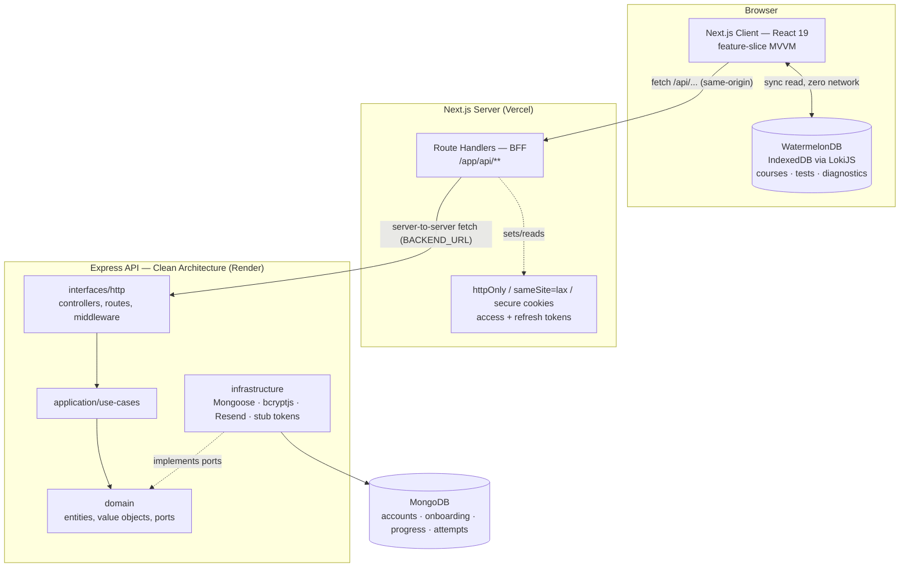
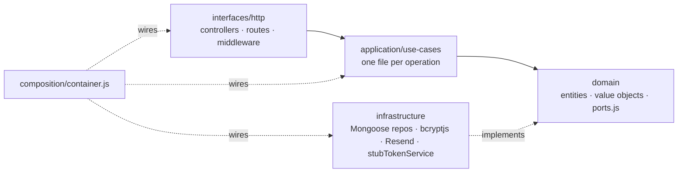
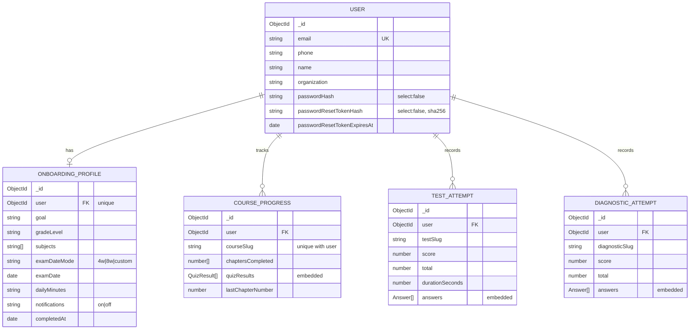
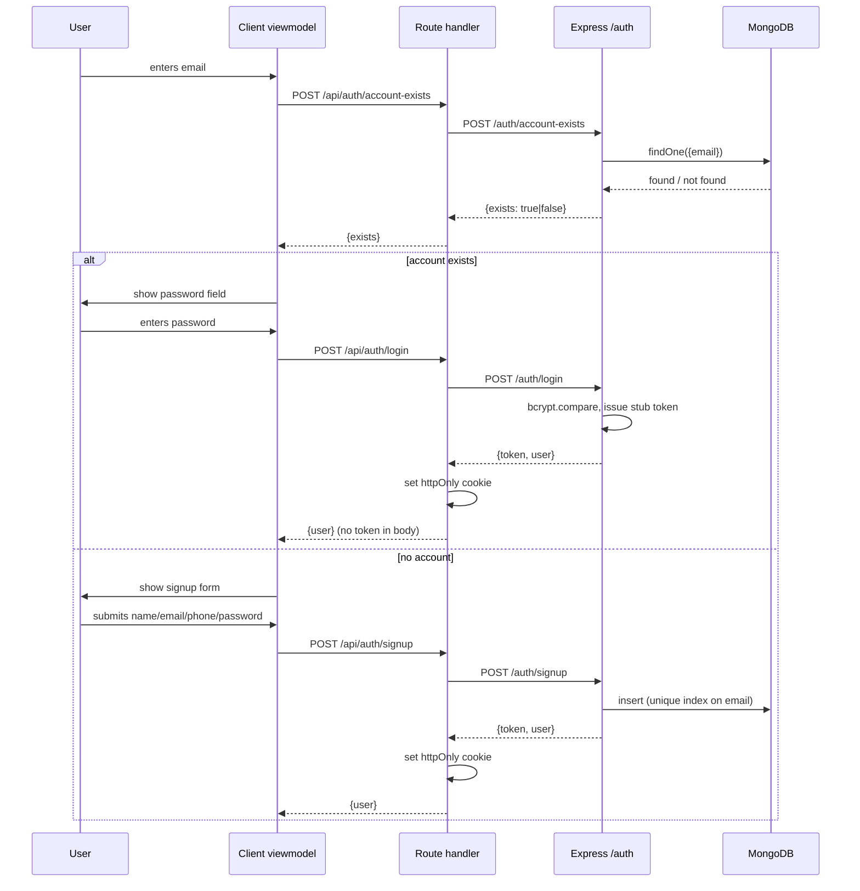
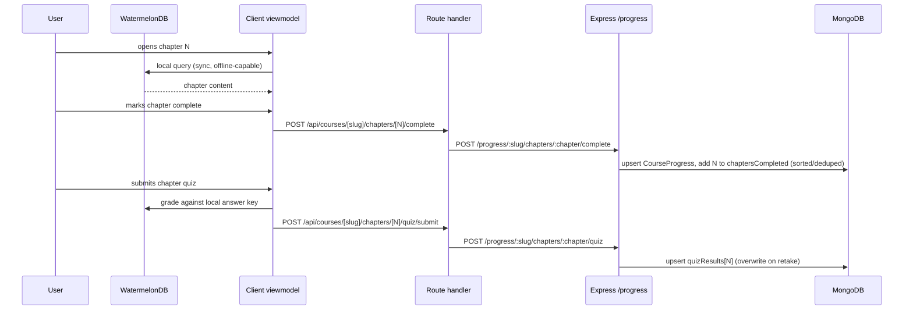
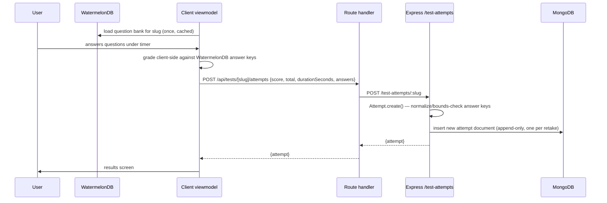
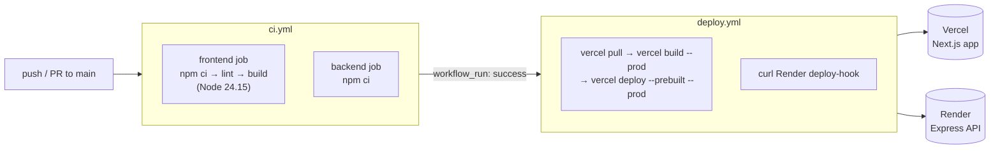

# GradeUp — System Design

**Exam-prep platform for Philippine Civil Service Commission (CSC) exams.**
This document specifies the system as built: architecture, data model, API
surface, core flows, and the design decisions behind them.

---

## 1. Overview

GradeUp lets civil servants preparing for CSC promotion/confirmation/conversion
exams work through structured courses, take timed practice tests, run a
diagnostic self-assessment, and track a readiness score — all from a browser,
including offline for content already loaded.

### 1.1 Functional requirements

| # | Requirement |
|---|---|
| F1 | Email-first authentication (system tells the user whether an account exists before asking for a password) |
| F2 | 8-step onboarding capturing goal, grade level, subjects, exam date, daily study-time target |
| F3 | Chapter-based courses with reading content, key terms, flashcards, per-chapter quiz |
| F4 | Timed practice tests drawn from a real CSC question bank, graded instantly |
| F5 | A one-time diagnostic assessment merged from multiple question banks |
| F6 | Dashboard showing a readiness score, per-course progress, and re-entry points |
| F7 | Progress and attempts persist per-user and are consistent across devices |

### 1.2 Non-functional requirements

| # | Requirement | Design response |
|---|---|---|
| N1 | Study content must load instantly and work with a flaky/offline connection | Content is seeded into an in-browser database once; reads never touch the network (§4) |
| N2 | Session tokens must not be exposed to client-side JS (XSS blast radius) | Tokens live only in `httpOnly` cookies, set by a server-side BFF layer (§3.2) |
| N3 | The identity/auth backend is expected to be replaced later by the real Civilpromo GraphQL API | Backend built as Clean/Hexagonal Architecture so the swap is isolated to one infrastructure module (§5.4) |
| N4 | A broken build must never reach production | CI gates deploy via `workflow_run` (§10) |
| N5 | Unexpected errors must be triaged without leaking internals to users | Central error mapping (backend) + `reportUnexpectedError` (frontend) + Sentry (§9) |

---

## 2. Architecture overview

GradeUp runs as two cooperating backends behind one Next.js application —
not because of scale, but because the two kinds of data behind them have
fundamentally different lifecycles (§4).

**The governing decision:** course/test/diagnostic *content* is large, static,
and identical for every user, so it is shipped as JSON, cached client-side in
WatermelonDB, and never touches Express or Mongo after the first load. Only
genuinely per-user, mutable *state* — identity, onboarding answers, progress,
attempts — goes through the backend. This single split is why the system has
two data paths instead of one, and it is revisited in every component below.

---

## 3. Component design

### 3.1 Frontend — Next.js App Router, feature-slice MVVM

**Stack:** Next.js 16 (App Router, Turbopack), React 19, TypeScript, Tailwind
CSS v4, shadcn-style components on Radix primitives.

Every product surface (`login`, `onboarding`, `dashboard`, `courses`, `tests`,
`diagnostics`, `peers`, `landing-page`, `forgot-password`, `reset-password`)
lives under `frontend/src/<feature>/` in the same shape:

| Layer | Responsibility |
|---|---|
| `model/` | Static copy, option lists, TypeScript types — content kept out of JSX |
| `view/` | Presentational components — render props, no business logic |
| `viewmodel/` | Client hooks owning state/orchestration (`useLoginFormViewModel`, …) |
| `repository/` / `data/` | Calls Next.js route handlers — **never** the Express API directly |
| `db/` *(courses, tests only)* | WatermelonDB schema, models, queries, seeding |

This convention makes location predictable across ~10 feature slices without
reading each one, and keeps components thin enough to unit-test in isolation
(no suite exercises them yet — see §13).

### 3.2 BFF layer — Next.js Route Handlers

The browser never calls Express directly and never holds a token. Each
route handler:

1. Receives a same-origin request from a client viewmodel.
2. Calls a **server-only** repository (`import "server-only"`) that performs
   the real `fetch` to `BACKEND_URL`.
3. On success, writes `httpOnly` + `sameSite=lax` (+ `secure` in prod) cookies
   via `lib/auth/cookies.ts`.
4. Translates a `BackendError` into the matching HTTP status; anything
   unexpected is sent to Sentry via `reportUnexpectedError()` and returned as
   a generic 500.

This is a deliberate BFF, not incidental API-route usage: it is the one seam
where every backend call is logged and error-handled consistently, and the
only place a token is ever materialized outside a cookie.

### 3.3 Local content store — WatermelonDB

1. Content is authored as JSON in-repo (`frontend/courses/`, `frontend/Tests/`,
   `frontend/Diagnostics_Test/`).
2. A route handler (e.g. `/api/courses/content`) reads that JSON off disk once.
3. The browser seeds it into WatermelonDB (`@nozbe/watermelondb`, LokiJS
   adapter over IndexedDB — no native SQLite build needed on web).
4. Every subsequent chapter/question read is a synchronous local query:
   instant, offline-capable, zero backend load.

Implementation constraints worth preserving:

- The LokiJS adapter is dynamically imported behind a `typeof window` guard —
  it must never run during server rendering.
- Nested structures (chapter sections, quiz options) are stored as JSON
  strings in scalar columns and parsed back out by model classes.
- `next.config.ts` sets `transpilePackages: ["@nozbe/watermelondb"]` (the
  package ships partially-untranspiled JS) and `outputFileTracingIncludes`
  for `/api/courses/content` and `/api/tests/content`, since Vercel's static
  analysis can't see the `readdir`/`readFile` calls those routes make.
  **`/api/diagnostics/content` is not in that whitelist despite the same
  access pattern** — see §13.

### 3.4 Backend — Express, Clean (Hexagonal) Architecture

Dependencies point inward only: `domain/` and `application/` never import
Express, Mongoose, or bcrypt — they call **ports** (`domain/ports.js`).
Concrete implementations live in `infrastructure/`; `composition/container.js`
is the only file allowed to wire a concrete module into a use case.

| Layer | Contents | Rule |
|---|---|---|
| `domain/` | `User`, `CourseProgress`, `OnboardingProfile`, `Attempt` entities; `Email` value object; `errors.js`; `ports.js` | Zero dependencies. Entities enforce their own invariants at construction (e.g. `Attempt.create()` bounds-checks and normalizes answer keys) |
| `application/use-cases/` | One factory per operation, grouped by feature: `auth/`, `onboarding/`, `progress/`, `attempts/` | Manual dependency injection — `makeLogin({userRepository, passwordHasher, tokenService})` — no DI framework |
| `infrastructure/` | Mongoose repositories/schemas, `bcryptPasswordHasher`, `resendEmailSender`, `stubTokenService`, config, logging | Only layer that knows Mongoose/bcrypt/Resend exist; repositories map documents to entities via a private `toEntity()` |
| `interfaces/http/` | Controllers, routes, `requireAuth`, `errorHandler` | Thin adapters — pull `req.body`, call a use case, `res.json()`. Zero business logic |
| `composition/container.js` | Composition root | The single place infra is instantiated and injected |

**Why this architecture here, specifically:** the codebase's own config
already carries a `GRAPHQL_ENDPOINT` value and `stubTokenService.js` states
outright that it's a placeholder for the real **Civilpromo GraphQL** identity
API. Clean Architecture means that swap is contained to
`infrastructure/security/` plus one line in `container.js` — `domain/` and
`application/`, where the business rules actually live, don't change.

**Error handling:** domain code throws semantic errors (`ValidationError`,
`UnauthorizedError`, `NotFoundError`, `ConflictError`) with no HTTP knowledge.
One file, `errorHandler.js`, maps error class → status code (400/401/404/409;
everything else → 500 with the message hidden from the client).

**Testing:** `backend/test/` uses Node's built-in `node:test` runner against
hand-written in-memory fakes for repositories/services — no MongoDB, no HTTP
server, millisecond runtime. Covers password-reset token lifecycle,
`CourseProgress` invariants, full signup (including duplicate-email and
password-too-short branches), and answer normalization/grading.

### 3.5 Database — MongoDB

One document store, four collections, all scoped by `user` reference. See §5
for the full schema.

---

## 4. Data architecture: content vs. state

| Data | Source of truth | Runtime home | Touches Express/Mongo? |
|---|---|---|---|
| Course/chapter/flashcard content | `frontend/courses/*.json` (git) | WatermelonDB (browser) | No |
| Practice test question banks | `frontend/Tests/*.json` (git) | WatermelonDB (browser) | No |
| Diagnostic question bank | `frontend/Diagnostics_Test/*.json` (git) | WatermelonDB (browser) | No |
| User accounts | MongoDB | Backend | Yes |
| Onboarding profile | MongoDB | Backend | Yes |
| Per-course progress | MongoDB | Backend | Yes |
| Test / diagnostic attempts | MongoDB | Backend | Yes |

**Rule of thumb:** if it's identical for every user, it's content and lives
client-side; if it's specific to one user and must be authoritative across
devices, it's state and lives on the backend. This is also the reliability
boundary: if the backend is unreachable, course/test *content* keeps working
because it's local; only progress/attempt writes fail. The progress client
degrades a 401 to "no progress" rather than throwing, so pages still render.

---

## 5. Data model

Content (courses, questions) is referenced by `slug`/`courseSlug`, not by a
foreign-key relationship to a Mongo document — the course/question documents
themselves don't exist server-side.

Notes:

- `TEST_ATTEMPT` and `DIAGNOSTIC_ATTEMPT` are two Mongo models generated from
  one schema factory (`makeAttemptModel(modelName, slugField)`) — they differ
  only in collection name and slug field, preserved exactly so no migration
  was needed when they were unified. Many attempts per `(user, slug)` are
  allowed; each retake is its own document.
- `COURSE_PROGRESS` is one document per `(user, courseSlug)`, enforced by a
  compound unique index, and stores the **latest** quiz result per chapter
  (overwritten on retake) rather than history.
- `passwordHash` and `passwordResetTokenHash` are `select: false` — excluded
  from every query by default; a repository must explicitly opt in.

---

## 6. API design

### 6.1 Backend — Express (mounted at `/`, base = `BACKEND_URL`)

| Method | Path | Auth | Use case |
|---|---|---|---|
| GET | `/health` | — | Liveness check |
| POST | `/auth/account-exists` | — | Step 1 of email-first login: does this email have an account? |
| POST | `/auth/login` | — | Password login for an existing account |
| POST | `/auth/signup` | — | Create account (phone collected, OTP verification intentionally out of scope) |
| POST | `/auth/forgot-password` | — | Always returns `{ok:true}` regardless of whether the email exists (anti-enumeration) |
| POST | `/auth/reset-password` | — | Complete reset with emailed token + new password |
| GET | `/onboarding` | ✓ | Fetch the caller's onboarding profile |
| POST | `/onboarding` | ✓ | Upsert onboarding answers |
| GET | `/progress` | ✓ | List progress across all courses |
| GET | `/progress/:slug` | ✓ | Progress for one course |
| POST | `/progress/:slug/chapters/:chapter/complete` | ✓ | Mark a chapter read |
| POST | `/progress/:slug/chapters/:chapter/quiz` | ✓ | Save a chapter quiz result |
| GET | `/test-attempts` | ✓ | List all test attempts |
| GET | `/test-attempts/:slug` | ✓ | Attempts for one test |
| POST | `/test-attempts/:slug` | ✓ | Record a graded test attempt |
| GET | `/diagnostic-attempts` | ✓ | List all diagnostic attempts |
| GET | `/diagnostic-attempts/:slug` | ✓ | Attempts for one diagnostic |
| POST | `/diagnostic-attempts/:slug` | ✓ | Record a graded diagnostic attempt |

`✓` = `requireAuth` middleware, reading the session cookie's bearer value.

### 6.2 Frontend BFF — Next.js Route Handlers (`/app/api/**`)

| Path | Backs onto | Notes |
|---|---|---|
| `/api/auth/account-exists`, `/login`, `/signup`, `/forgot-password`, `/reset-password` | `/auth/*` | Sets/clears session cookies |
| `/api/auth/logout` | — | Clears cookies locally, no backend call needed (stub tokens are stateless) |
| `/api/onboarding` | `/onboarding` | — |
| `/api/courses/content` | local JSON | Disk read, whitelisted for Vercel bundling |
| `/api/courses/progress`, `/api/courses/[slug]/progress` | `/progress`, `/progress/:slug` | — |
| `/api/courses/[slug]/chapters/[chapter]/complete` | `/progress/:slug/chapters/:chapter/complete` | — |
| `/api/courses/[slug]/chapters/[chapter]/quiz/submit` | `/progress/:slug/chapters/:chapter/quiz` | — |
| `/api/tests/content` | local JSON | Disk read, whitelisted |
| `/api/tests/attempts`, `/api/tests/[slug]/attempts` | `/test-attempts*` | — |
| `/api/diagnostics/content` | local JSON | Disk read, **not** whitelisted — see §13 |
| `/api/diagnostics/attempts`, `/api/diagnostics/[slug]/attempts` | `/diagnostic-attempts*` | — |

---

## 7. Core flows

### 7.1 Email-first authentication

The email-first split is a product decision as much as a technical one — the
UI never shows "log in" vs. "sign up" as separate entry points; the backend
tells the frontend which path to render.

### 7.2 Course chapter read + quiz

### 7.3 Timed test attempt

---

## 8. Security design

| Concern | Mechanism |
|---|---|
| Password storage | bcryptjs, cost factor 10; pure JS to avoid a native build step in CI/deploy |
| Session delivery | `httpOnly` + `sameSite=lax` (+`secure` in prod) cookies; token never reaches browser JS |
| Field exposure | `passwordHash`, `passwordResetTokenHash` are `select: false` in Mongoose — opt-in only |
| Password reset | Random 32-byte token emailed once; only its SHA-256 hash persisted, TTL-bound, cleared on use |
| Account enumeration | `forgot-password` always returns `{ok:true}` regardless of account existence |
| Signup race condition | Duplicate email guarded by a unique Mongo index, not just app-level checks; `E11000` is translated to a domain `ConflictError` |
| CORS | Locked to one configured origin (`CORS_ORIGIN`), not `*` |
| Error disclosure | 500s hide their message from the client and go to Sentry server-side; 4xx validation messages are considered safe to expose |
| Identity provider | `stubTokenService` issues an opaque, non-JWT token — explicitly a placeholder pending the real Civilpromo GraphQL identity API; isolated behind the `TokenService` port |

---

## 9. Observability

- **Sentry (`@sentry/nextjs`)** wired for all three Next.js runtimes — client
  (`instrumentation-client.ts`), server (`sentry.server.config.ts`), edge
  (`sentry.edge.config.ts`) — loaded via the `register()` hook.
- `reportUnexpectedError(error, {route})` is the one-line helper every route
  handler's catch-all calls, so only genuinely unexpected failures reach
  Sentry — expected `BackendError`s are handled separately and don't spam it.
- `Sentry.setUser(...)` is called both server-side (auth route handlers,
  right after login/signup) and client-side (login viewmodel), so every
  subsequent error is attributed to a user regardless of where it originates.
- **Amplitude** (`@amplitude/unified`) is initialized client-side in
  `instrumentation-client.ts` for product analytics, separate from the
  Sentry error pipeline.
- Backend uses `morgan` request logging in non-test environments plus a
  structured logger (`infrastructure/logging/logger.js`).

---

## 10. CI/CD & deployment

Both deploy jobs gate on CI success (via `workflow_run`), so a broken
lint/build never reaches production automatically. `deploy.yml` also supports
manual `workflow_dispatch`.

---

## 11. Scalability & reliability

- **Read load is structurally minimized.** The majority of reads (all course
  and question content) never reach the backend at all — they're served once
  as JSON and cached in the browser. Backend load scales with *active users
  writing state*, not with *content views*, which is the dominant traffic
  pattern for a study app.
- **Stateless backend.** The Express API holds no server-side session state
  (the stub token is self-describing), so it can scale horizontally behind
  Render without sticky sessions.
- **Graceful degradation.** If the backend is unreachable, course/test
  content keeps working (client-local); only progress/attempt writes fail,
  and the progress client treats a 401 as "no progress" rather than crashing
  the page.
- **Data integrity under concurrency** is enforced at the database layer
  where it matters: unique index on `User.email`, compound unique index on
  `(user, courseSlug)` for `CourseProgress` — not left to application-level
  race-prone checks.

---

## 12. Trade-offs & alternatives considered

| Decision | Alternative | Why this way |
|---|---|---|
| Split content (client-local) vs. state (backend) | Serve everything from Mongo | Content is static and identical per user; round-tripping it adds latency and backend load for no benefit |
| BFF via Next.js Route Handlers | Call Express directly from the browser | Keeps tokens out of client JS entirely; one seam for logging/error handling instead of duplicating it per component |
| Clean/Hexagonal Architecture on the backend | Simple MVC/Express-only structure | A known, upcoming rewrite (Mongo auth → Civilpromo GraphQL) is made cheap: isolated to `infrastructure/` + one line in the composition root |
| Manual DI (factory functions) | A DI framework/container library | At this scale, one readable composition root beats reflection-based magic |
| `node:test` for backend tests | Jest/Mocha | Zero extra dependency; business logic is tested against hand-written fakes, which doesn't need Jest's mocking/snapshot machinery |
| bcryptjs | Native `bcrypt` | No native build step — simpler, more portable installs/CI/deploys |
| WatermelonDB + LokiJS/IndexedDB | SQLite (native) or plain `localStorage` | No native build needed on web; richer querying than raw `localStorage` for chapter/question data |

---

## 13. Known gaps & roadmap

- **Backend tests aren't run in CI.** `backend/test/` passes locally
  (`npm test`) but `ci.yml`'s backend job only runs `npm ci`.
- **No frontend test suite yet.** Viewmodels are structured to be testable in
  isolation (pure hooks, clear inputs/outputs), but nothing exercises them.
- **`/api/diagnostics/content` is missing from `outputFileTracingIncludes`**
  in `next.config.ts`, unlike its `courses`/`tests` counterparts, despite
  reading JSON off disk the same way — likely serves an empty diagnostic in
  production (`{version: "empty", tests: []}` is the route's own fallback on
  a failed read, so this fails quiet rather than loud).
- **`stubTokenService` is not a real token/JWT system** — an intentional,
  self-documented placeholder pending the Civilpromo GraphQL identity API.
  Isolated behind the `TokenService` port so the swap is contained (§3.4).
  `graphql` / `graphql-request` are already frontend dependencies in
  anticipation of this.
- **No automated Clean Architecture boundary enforcement** — layering is
  followed by convention and review, not tooling (e.g. no dependency-cruiser
  rule), flagged as a follow-up in `backend/docs/ARCHITECTURE.md`.
- **Phone number is collected but not verified** — OTP was intentionally
  scoped out of MVP signup; the field exists for future use.
- **Peers is scaffolded, not real.** `model/view/viewmodel` exist under
  `src/peers/`, but there's no backend support and sample data is hardcoded
  empty.
- **Dashboard's "Continue learning" / "Today's goal" widgets are explicit
  placeholders**, not yet wired to real study data.
- **`backend/README.md` is stale** (pre-Clean-Architecture); `backend/docs/ARCHITECTURE.md`
  and `FILE_REFERENCE.md` are the current, accurate docs.

---

## 14. Tech stack reference

| Layer | Technology |
|---|---|
| Frontend framework | Next.js 16 (App Router, Turbopack) |
| UI | React 19, TypeScript, Tailwind CSS v4, shadcn/Radix |
| Client-side database | WatermelonDB 0.28 (LokiJS/IndexedDB adapter) |
| Backend framework | Express 5 |
| Database | MongoDB via Mongoose 9 |
| Password hashing | bcryptjs |
| Transactional email | Resend |
| Backend testing | `node:test` (built into Node) |
| Error tracking | Sentry (`@sentry/nextjs`) |
| Product analytics | Amplitude (`@amplitude/unified`) |
| CI/CD | GitHub Actions |
| Hosting | Vercel (frontend), Render (backend) |
